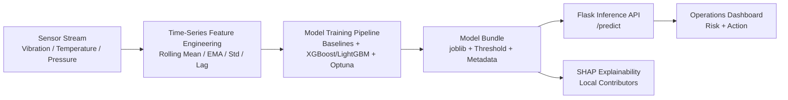
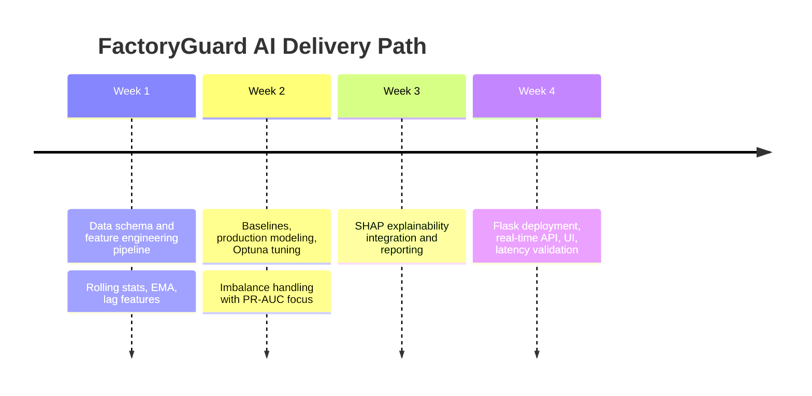

<div align="center">

# FactoryGuard AI
### IoT Predictive Maintenance Engine

**Predict catastrophic robotic-arm failures up to 24 hours in advance**


</div>

---

## Product Vision

FactoryGuard AI turns raw factory telemetry into actionable maintenance intelligence.

- Plant scale: **500 robotic arms**
- Data signals: **vibration, temperature, pressure**
- Business target: **avoid unplanned downtime**
- Prediction horizon: **next 24 hours**

---

## Visual Architecture



---

## System Highlights

| Capability | What It Delivers |
|---|---|
| Advanced Time Features | Captures trend, drift, and volatility using `1h`, `6h`, `12h` windows |
| Imbalance-Aware Learning | Handles rare failures with PR-AUC optimization and class weighting |
| Production Models | XGBoost (default) / LightGBM with Optuna tuning |
| Explainable Output | SHAP-based local reasoning for maintenance decisions |
| Low-Latency Serving | Real-time JSON API with p95 latency checks |
| Operator-Friendly UI | Dashboard for non-technical stakeholders |

---

## Tech Stack

```text
Python 3.11+, Pandas, NumPy
scikit-learn, imbalanced-learn
XGBoost, LightGBM, Optuna
SHAP, Flask, joblib
```

---

## Repository Map

```text
.
|-- api/
|   |-- app.py                    # Flask API + Dashboard UI
|-- src/
|   |-- feature_engineering.py    # Rolling stats, EMA, lag features
|   |-- model_trainer.py          # Baselines + tuned production model
|   |-- train_pipeline.py         # End-to-end training + artifact export
|   |-- explainability.py         # SHAP local explanations
|-- scripts/
|   |-- latency_check.py          # p95 inference latency benchmark
|-- requirements.txt
|-- README.md
```

---

## Quickstart

### 1) Setup Environment

```bash
python -m venv .venv
.venv\Scripts\activate
pip install -r requirements.txt
```

### 2) Train Model

```bash
python -m src.train_pipeline --model-family xgboost --n-trials 5
```

Optional:

```bash
python -m src.train_pipeline --model-family lightgbm --n-trials 10
python -m src.train_pipeline --model-family xgboost --use-smote --n-trials 10
```

Artifacts generated:

- `models/factoryguard_model.joblib`
- `reports/training_metrics.json`

### 3) Run API + Dashboard

```bash
python -m api.app
```

Open:

- `http://127.0.0.1:8000/`
- `http://127.0.0.1:8000/health`

---

## Inference API

### Endpoint

`POST /predict`

### Request

```json
{
  "rows": [
    {
      "arm_id": 101,
      "timestamp": "2026-02-27T08:00:00Z",
      "vibration": 0.61,
      "temperature": 74.1,
      "pressure": 29.0
    },
    {
      "arm_id": 101,
      "timestamp": "2026-02-27T09:00:00Z",
      "vibration": 0.66,
      "temperature": 76.8,
      "pressure": 29.6
    }
  ]
}
```

### Response

```json
{
  "product": "FactoryGuard AI",
  "failure_probability_24h": 0.43,
  "predicted_failure_24h": 1,
  "decision_threshold": 0.11,
  "latency_ms": 8.7
}
```

---

## Explainability Layer

Generate SHAP contributors for local predictions:

```bash
python -m src.explainability --model-path models/factoryguard_model.joblib --input-csv data/sensor_timeseries.csv
```

Output:

- `reports/shap_local_explanation.json`

---

## Performance Gate

Run latency benchmark:

```bash
python scripts/latency_check.py
```

Tracks:

- Mean latency
- P95 latency
- Max latency
- Pass/Fail against `< 50ms` p95 target

---

## Delivery Timeline (Execution View)



---

## Production Hardening Roadmap

- Containerized inference service
- API auth + rate limiting
- Model registry and versioned rollbacks
- CI for model quality and API contracts
- Monitoring: drift, latency, alert precision, failure recall

---

## License

Internal / project-specific. Add OSS license before public open-source release.

