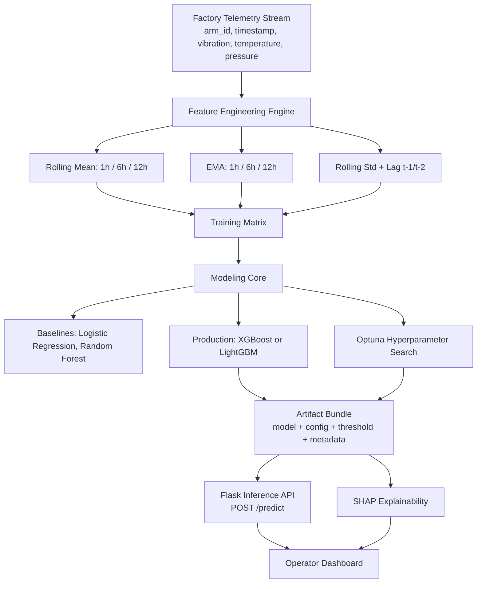
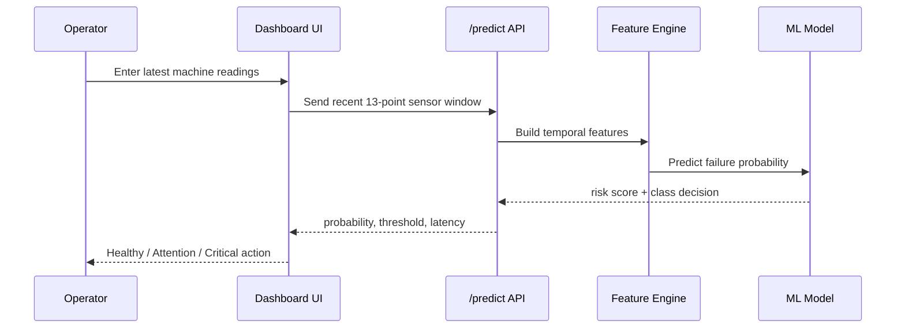
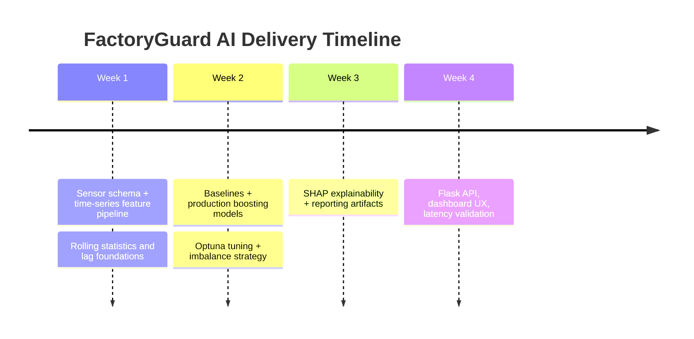

<div align="center">

# FactoryGuard AI
### Industrial Intelligence Layer for Predictive Maintenance

<p>
  <b>From raw telemetry to maintenance action in real time</b><br/>
  Predict catastrophic robotic-arm failures up to <b>24 hours early</b>.
</p>

<p>
  
  
  
</p>
<p>
  
  
  
</p>

</div>

---

## Table of Contents

- [Why FactoryGuard AI](#why-factoryguard-ai)
- [System at a Glance](#system-at-a-glance)
- [Architecture Graph](#architecture-graph)
- [Operator Journey](#operator-journey)
- [Model Card](#model-card)
- [Tech Stack](#tech-stack)
- [Repository Layout](#repository-layout)
- [Quickstart](#quickstart)
- [Inference API](#inference-api)
- [Explainability Workflow](#explainability-workflow)
- [Reliability and Latency](#reliability-and-latency)
- [Execution Timeline](#execution-timeline)
- [Production Blueprint](#production-blueprint)

---

## Why FactoryGuard AI

Modern factories run large robotic fleets where failures are rare but expensive.  
FactoryGuard AI is built to solve exactly that regime:

- Predict failure in the **next 24 hours**
- Prioritize **high precision** to avoid false alarms
- Convert model output into **clear maintenance action**
- Keep scoring fast enough for operational usage

<div align="center">
  
  
  
</div>

---

## System at a Glance

| Layer | Capability | Output |
|---|---|---|
| Data Layer | Ingest timestamped telemetry per arm | Clean chronological sequences |
| Feature Layer | Rolling mean/EMA/std + lag signals | Temporal feature vectors |
| ML Layer | Baselines + tuned gradient boosting | Failure probability |
| Decision Layer | Thresholding optimized for precision | `predicted_failure_24h` |
| Explainability Layer | SHAP local attributions | Top contributing features |
| Serving Layer | Flask endpoint + UI dashboard | Real-time operator decision support |

---

## Architecture Graph



---

## Operator Journey



---

## Model Card

### Objective
Binary classification: predict whether failure occurs within next 24 hours.

### Input Signals
- `vibration`
- `temperature`
- `pressure`
- temporal context per arm (`timestamp`)

### Feature Space
- Rolling mean (`1h`, `6h`, `12h`)
- EMA (`1h`, `6h`, `12h`)
- Rolling std (`1h`, `6h`, `12h`)
- Lag features (`t-1`, `t-2`)

### Candidate Models
- Logistic Regression
- Random Forest
- XGBoost
- LightGBM

### Evaluation Priority
- Primary metric: **PR-AUC**
- Secondary checks: decision threshold behavior, latency profile

### Imbalance Strategy
- `scale_pos_weight` class weighting (default)
- optional `--use-smote`

---

## Tech Stack

```text
Python 3.11+
Pandas, NumPy
scikit-learn, imbalanced-learn
XGBoost, LightGBM, Optuna
SHAP
Flask
joblib
```

---

## Repository Layout

```text
.
|-- api/
|   |-- app.py                     # Inference API + dashboard UI
|-- src/
|   |-- feature_engineering.py     # Rolling/EMA/std/lag feature generation
|   |-- model_trainer.py           # Baselines + tuned production model
|   |-- train_pipeline.py          # Train + evaluate + persist model bundle
|   |-- explainability.py          # SHAP local explanation export
|-- scripts/
|   |-- latency_check.py           # p95 latency benchmark
|-- requirements.txt
|-- README.md
```

---

## Quickstart

### 1) Environment setup

```bash
python -m venv .venv
.venv\Scripts\activate
pip install -r requirements.txt
```

### 2) Train model

```bash
python -m src.train_pipeline --model-family xgboost --n-trials 5
```

Optional runs:

```bash
python -m src.train_pipeline --model-family lightgbm --n-trials 10
python -m src.train_pipeline --model-family xgboost --use-smote --n-trials 10
```

Generated artifacts:

- `models/factoryguard_model.joblib`
- `reports/training_metrics.json`

### 3) Launch API + dashboard

```bash
python -m api.app
```

Open:

- `http://127.0.0.1:8000/`
- `http://127.0.0.1:8000/health`

---

## Inference API

### `POST /predict`

Request:

```json
{
  "rows": [
    {
      "arm_id": 101,
      "timestamp": "2026-02-27T08:00:00Z",
      "vibration": 0.61,
      "temperature": 74.1,
      "pressure": 29.0
    },
    {
      "arm_id": 101,
      "timestamp": "2026-02-27T09:00:00Z",
      "vibration": 0.66,
      "temperature": 76.8,
      "pressure": 29.6
    }
  ]
}
```

Response:

```json
{
  "product": "FactoryGuard AI",
  "failure_probability_24h": 0.43,
  "predicted_failure_24h": 1,
  "decision_threshold": 0.11,
  "latency_ms": 8.7
}
```

---

## Explainability Workflow

```bash
python -m src.explainability --model-path models/factoryguard_model.joblib --input-csv data/sensor_timeseries.csv
```

Output:

- `reports/shap_local_explanation.json`

---

## Reliability and Latency

Run benchmark:

```bash
python scripts/latency_check.py
```

Captured metrics:

- mean latency
- p95 latency
- max latency
- `p95 < 50ms` pass/fail check

---

## Execution Timeline



---

## Production Blueprint

### Recommended next upgrades

- Containerized serving (`Docker`)
- API authentication and rate limiting
- Model registry + version pinning
- CI/CD gates for:
  - PR-AUC regression
  - latency regression
  - API contract validation
- Observability:
  - input drift
  - output drift
  - alert precision over time

---

## License

Internal / project-specific.  
Add an OSS license (MIT / Apache-2.0) before public open-source release.

